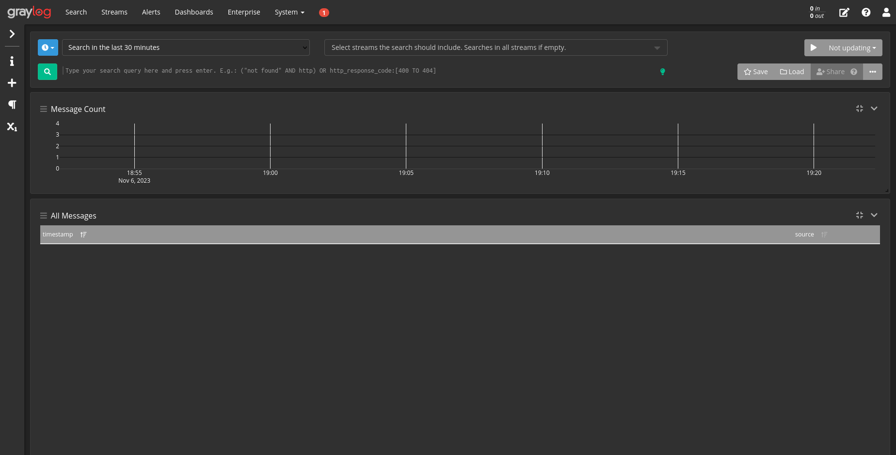

# Projeto Observability

Projeto desenvolvido no módulo "Observability" ministrado pelo professor Israel na Formação DevOps através do programa Ser+Tech (Ada Tech + Núclea).

## Equipe
- Carlos Eduardo
- Luciano
- Patrick

## Desafio
Realizar a criação e configuração do ambiente de observability utilizando as ferramentas: Prometheus, Alertmanager, Grafana, Cadvisor e um Container em Python (Gerando um Server WEB local para amostragens de métricas dos status code: 200 e 401, e algum outro caso o aluno tenha customizado);

Realizar a criação e configuração do ambiente de Logs utilizando as ferramentas: MongoDB, Elasticsearch e Graylog gerando logs básicos das aplicações;

## Como rodar
> Passos focados para o ambiente Linux

Clone o projeto

```bash
  git clone https://github.com/caducoder/projeto-observability.git
```

Entre no diretório do projeto

```bash
  cd projeto-observability
```

Vá para a pasta exporter e construa a imagem da api

```bash
  docker build -t flaskapp:1.0 .
```
Aumente a memória de mapeamento para o funcionamento adequado do elasticsearch

```bash
  sudo sysctl -w vm.max_map_count=262144
```

Volte para pasta root e suba os containers

```bash
  docker-compose -f compose.yml -f compose2.yml up -d
```

Aguarde o container do graylog ficar com status healthy, e pegue o ip com o seguinte comando

```bash
  docker inspect graylog | grep IPAddress
```

Descomente a parte de logging no service apipython do arquivo compose.yml e coloque o IP recebido no passo anterior no lugar de IP_GRAYLOG. Reinicie o container apipython

```bash
  docker-compose restart apipython
```

Pronto, seu ambiente está configurado.

## Dashboard Grafana


## Tela do Graylog

